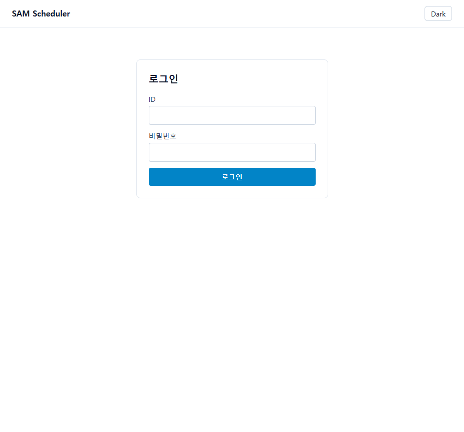
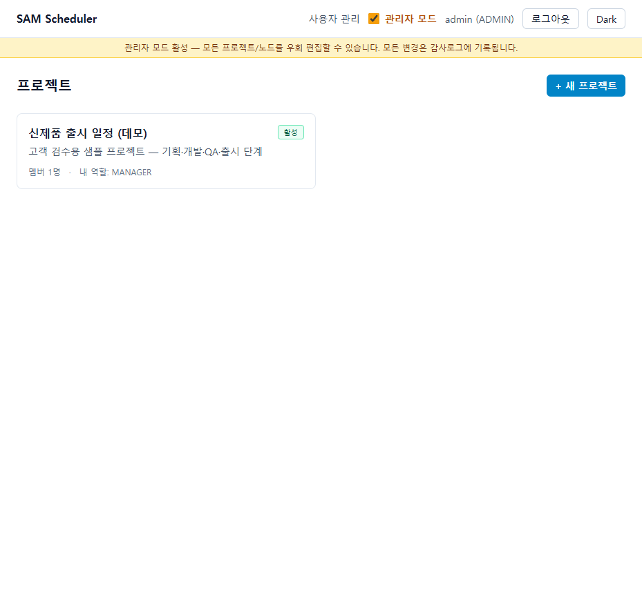
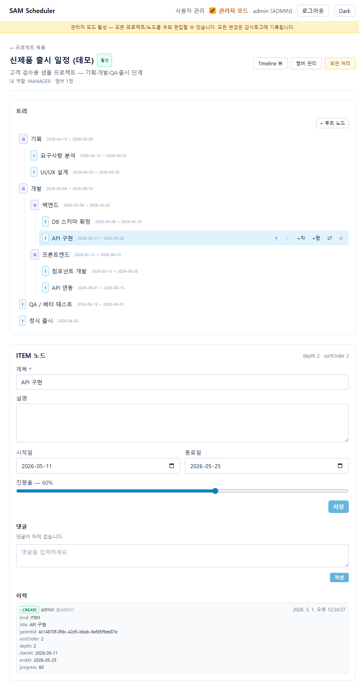
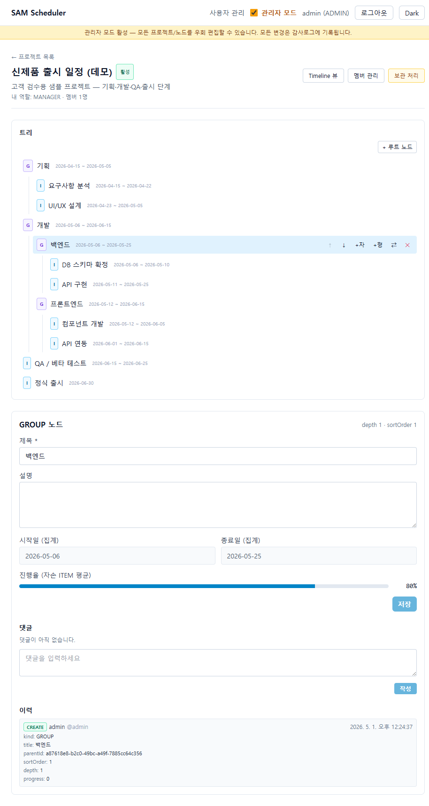
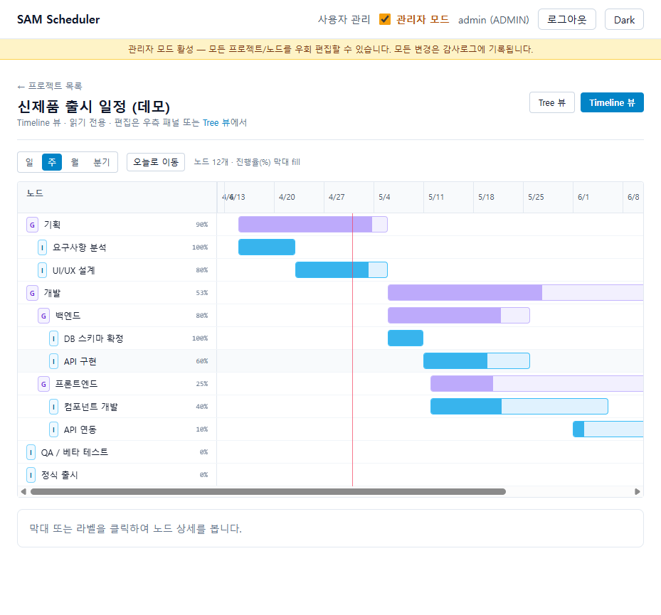
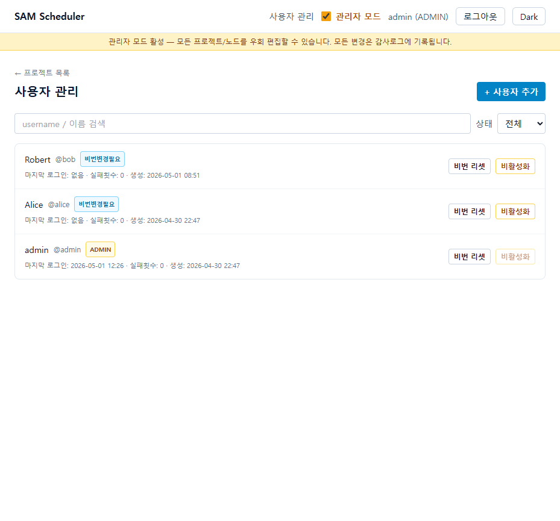
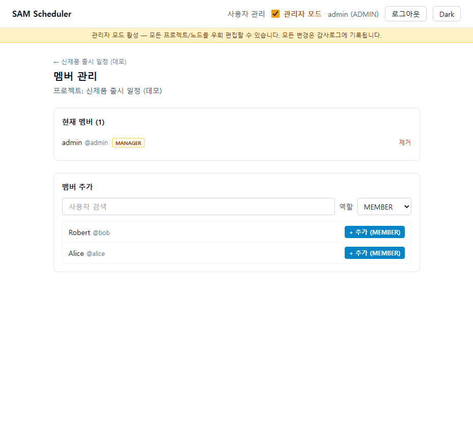

# SAM Scheduler — 고객 검수 안내

> **검수 목적**: 현재까지 구현된 화면과 동작이 요구사항과 부합하는지 확인.
> **검수 범위**: 인증 / 프로젝트·트리 관리 / Timeline / 사용자·멤버 관리 / 백업 자동화.
> **검수 시점**: 2026-05-01 (M3 완료, v1 출시 직전 단계)
> **남은 작업**: 오프라인 배포 패키징(M4) + 운영 가이드.

---

## 1. 한 줄 소개

**일정·할일을 트리(Group/Item) 로 관리하고, Timeline 으로 한눈에 보는 사내 도구.** 사용자/프로젝트/멤버/권한은 ADMIN 이 관리하고, 매일 자동 백업이 돌도록 설계되어 있습니다. SQLite 기반 단일 컨테이너로 사내 air-gap 환경에 그대로 배포 가능합니다.

---

## 2. 권한 / 역할 모델 (DESIGN §4)

| 역할 | 부여 방식 | 설명 |
|---|---|---|
| **ADMIN** (글로벌) | 환경변수로 1회 시딩, DB 직접 조작만 가능 | 사용자 관리, 프로젝트 생성/삭제, "관리자 모드" 진입 시 모든 프로젝트 우회 편집 |
| **USER** (글로벌) | ADMIN 이 화면에서 생성 | 본인이 멤버인 프로젝트만 보임 |
| **MANAGER** (프로젝트별) | 프로젝트 생성 시 1명 이상 지정. 이후 ADMIN 또는 다른 MANAGER 가 추가 | 프로젝트 보관/복원, 멤버 추가/제외, 노드 CRUD |
| **MEMBER** (프로젝트별) | MANAGER 가 추가 | 노드 CRUD (보관/복원·멤버 관리 불가) |

> 단일 ADMIN 운영을 가정합니다 (전체 사용자 ≤ 150명). 화면에서 만드는 사용자는 항상 일반 USER 권한입니다.

**관리자 모드**: ADMIN 이 헤더 토글로 켜고 끔. 켜져 있으면 모든 프로젝트/노드를 우회 편집할 수 있고, 모든 변경은 감사로그(AuditLog)에 별도로 기록됩니다.

---

## 3. 화면별 안내

### 3.1 로그인

- ID / 비밀번호 로그인. 비밀번호는 **최소 10자, 영문/숫자/특수 중 3종 이상, username 포함 금지**.
- 5회 연속 실패 시 **15분 자동 잠금**. ADMIN 이 사용자 관리 화면에서 잠금 해제 가능.
- 세션은 **30분 유휴 + 절대 12시간** 만료. 쿠키는 HttpOnly + SameSite=Lax.
- 임시 비밀번호로 처음 로그인하면 **비밀번호 변경 화면으로 자동 이동** 후에야 다른 페이지 접근 가능.

---

### 3.2 프로젝트 목록

- 본인이 속한 프로젝트 카드. ADMIN + 관리자 모드 ON 이면 모든 프로젝트가 보임.
- 카드: 이름 / 설명 / 활성·보관 상태 / 멤버 수 / 내 역할.
- "+ 새 프로젝트" 버튼은 **ADMIN + 관리자 모드 ON** 일 때만 노출.

> 화면 상단 노란 띠는 **관리자 모드 활성** 안내 — 다른 사용자에게는 보이지 않습니다.

---

### 3.3 프로젝트 상세 — Tree 뷰

**좌측: 일정 트리** (최대 5단계)
- `G` = Group (묶음, 자체 일자는 자식들로 자동 산출)
- `I` = Item (실제 일정, 시작/종료/진행율 직접 입력)
- 호버 시 **↑↓ +자 +형 ⇄ ✕** — 위/아래 형제 이동, 자식/형제 추가, 부모 변경, 삭제
- 깊이가 한계(5단계)에 도달하면 "+자" 비활성

**우측 패널** (선택한 노드)
- 제목 / 설명 / 시작일 / 종료일 / **진행율 슬라이더 (0~100%, 5 단위)**
- **댓글**: 작성자/MANAGER/관리자모드 ADMIN 만 삭제 가능
- **이력**: 노드 생성·수정·이동·삭제가 자동 기록 (`progress: 0 → 60` 같은 변경 diff 가 그대로 보임)

> 동시 편집 충돌은 자동 감지 — 다른 사람이 먼저 수정한 경우 토스트로 안내.

---

### 3.4 GROUP 자동 집계

GROUP 노드는 **시작일 / 종료일 / 진행율을 직접 입력하지 않습니다**. 자식 ITEM 들로부터 자동 산출:

- **시작일 (집계)** = 자손 ITEM 의 가장 빠른 시작일
- **종료일 (집계)** = 자손 ITEM 의 가장 늦은 종료일
- **진행율 (자손 ITEM 평균)** = 자손 ITEM 들의 진행율 단순평균 (반올림)

예) "백엔드" GROUP — DB 스키마 확정 100% + API 구현 60% → **80%**

> 자손 ITEM 이 0개인 GROUP 은 진행율 = "산출되지 않습니다." 로 표기.

---

### 3.5 Timeline 뷰

`/projects/:id/timeline` — Tree 뷰의 데이터를 **간트 형태**로 시각화:

- 단위 토글: **일 / 주 / 월 / 분기**
- 좌측: 트리 라벨 (들여쓰기 + 진행율 %)
- 막대: ITEM 은 `시작일 ~ 종료일`, GROUP 은 자동집계 범위 (옅은 보라색)
- **막대 안의 진한 fill = 진행율** (예: 60% 면 막대의 60% 가 채워짐)
- 빨간 세로선 = 오늘. "오늘로 이동" 버튼이 가로 스크롤을 이동시킴
- 일자 없는 노드도 라벨은 표시 (구조 유지)
- 막대 클릭 → 우측 패널에서 그대로 편집 가능 (Tree 뷰와 동일)

> v1 은 **막대 자체는 읽기 전용** (드래그로 일자 조정은 v1.x 에서 추가 예정). 일자/진행율 변경은 우측 패널에서 합니다.

---

### 3.6 사용자 관리 (ADMIN)

- 검색 / 상태(전체·활성·비활성) 필터
- 행 클릭으로 **표시 이름 인라인 편집** (username 은 변경 불가)
- 배지: `ADMIN`, `비번변경필요`, `비활성`, `잠김`
- **+ 사용자 추가**: username / 표시이름 / 초기 비밀번호 입력 → USER 권한으로 생성, 첫 로그인 시 비밀번호 변경 강제
- **비번 리셋**: 임시 비밀번호 발급 → 1회성 모달로 표시 + 복사 버튼. 닫으면 다시 못 봄. 모든 기존 세션 폐기.
- **잠금 해제**: 5회 실패로 잠긴 사용자 풀어주기
- **활성/비활성 토글**: 비활성 사용자는 로그인 불가, 모든 세션 즉시 폐기. 자기 자신 비활성화는 차단.

---

### 3.7 멤버 관리 (프로젝트별)

- **현재 멤버**: 표시 이름 / 역할(MANAGER·MEMBER) / 제거
- **멤버 추가**: 사용자 검색 → 역할 선택(기본 MEMBER) → "+ 추가"
- 마지막 MANAGER 제거는 거부됩니다 (LAST_MANAGER 토스트)

---

## 4. 자동화 / 안전장치

### 4.1 자동 백업 (DESIGN §7)
- 매일 **04:00 (Asia/Seoul)** 에 SQLite VACUUM INTO + gzip + sha256 해시 생성
- 저장: `BACKUP_DIR/YYYYMMDD/app.db.gz` (+ `.sha256` 사이드카)
- 보존 기간 초과(`BACKUP_RETENTION_DAYS`, 기본 30일) 자동 삭제
- ADMIN 은 즉시 백업 수동 트리거 가능 (`/admin/health/backup/run`)
- 동시 실행 방지 (overlap 게이트)
- 백업 마지막 성공 시각/크기는 `/health/backup` 에서 확인

### 4.2 감사로그 (AuditLog)
다음 행위는 누가/언제/어디서(IP/User-Agent) 했는지 자동 기록됩니다.
- 로그인 성공·실패·잠금
- 비밀번호 변경 / 사용자 생성·수정·활성·비활성·리셋·잠금해제
- 프로젝트 생성·수정·보관·복원·삭제
- 멤버 추가·제거
- 노드 생성·수정·이동·삭제
- **관리자 모드로 한 모든 편집** (별도 `ADMIN_OVERRIDE_EDIT` 액션)

### 4.3 권한 / 동시성 / 보안
- 모든 상태 변경은 `Origin/Referer` 검사 (CSRF 방어)
- 노드/프로젝트 수정 시 **`expectedUpdatedAt`** 필수 → 다른 사람이 먼저 수정했으면 409 충돌 (토스트로 안내)
- 노드 깊이 ≤ 5단계 / 사이클 차단 / 다른 프로젝트로 이동 차단
- GROUP 의 일자·진행율 직접 입력 거부 (`GROUP_DATES_NOT_EDITABLE`, `GROUP_PROGRESS_NOT_EDITABLE`)
- 프로젝트 영구 삭제는 **보관(ARCHIVED) 상태일 때만**. 활성 상태는 거부.

---

## 5. 알려진 한계 / v1 미포함 (의도)

| # | 항목 | v1 처리 | 향후 |
|---|---|---|---|
| 1 | Timeline 막대 드래그로 일자 조정 | 미지원 | v1.x 에서 추가 |
| 2 | 트리 드래그&드롭 이동 | 미지원 (↑↓ 형제 이동 + ⇄ 부모 변경 모달로 대체) | 검토 |
| 3 | 캘린더 뷰 | 미지원 | v1.1+ |
| 4 | 첨부파일 / 의존성(선후행) / 반복 일정 | 미지원 | v1.1+ |
| 5 | LDAP / SSO 연동 | 미지원 | v1.x (`auth_providers` 추상 인터페이스 자리만 마련) |
| 6 | 이력 페이지네이션 | 최신 200건 | v1.x |
| 7 | 외부 모니터링/알림 연동 | `/health` 엔드포인트만 제공 | 운영 환경에서 가능 |
| 8 | 다국어 | 한국어만 (i18n 분리는 v1.x) | 영어 추가 시 파일 1개로 |

---

## 6. 운영·배포 (M4 — 다음 단계)

다음 작업으로 v1 출시 직전:
- Docker 이미지 빌드 + `tar` 묶음 (`docker save`) → 사내망 반입 가능한 단일 패키지
- `install.sh` / `upgrade.sh` 검증
- 시스템 복원 (`restore-system.sh`) 한 번 실제로 돌려봄
- `docs/ops-guide.md` (백업/복원/업그레이드/트러블슈팅 매뉴얼) 작성

→ 검수 통과 후 진행 예정.

---

## 7. 검수 부탁드리는 사항 (체크리스트)

검토 후 코멘트 부탁드립니다.

### 7.1 권한 / 역할 모델
- [ ] **단일 ADMIN 운영** (DESIGN §12-⑥) 이 의도와 맞는지 — 권한 승격 (USER → ADMIN) 은 화면에서 불가능, 시딩/DB 직접 조작만 가능.
- [ ] MANAGER / MEMBER 의 권한 차이가 충분한지 (MEMBER 는 노드 CRUD 가능, 멤버 관리 불가).
- [ ] 관리자 모드로 한 편집을 별도 감사로그(ADMIN_OVERRIDE_EDIT) 로 남기는 정책 OK 여부.

### 7.2 일정 모델
- [ ] **Group / Item 2단 분리** + 5단계 깊이 제한이 충분한지.
- [ ] GROUP 의 일자·진행율을 **자동 집계만** 하는 정책 (직접 입력 차단) OK 여부.
- [ ] 진행율 집계가 **자손 ITEM 단순평균** 으로 충분한지 (vs 기간 가중 평균).
- [ ] 일자 단위가 **날짜(date)** 면 충분한지 (시간 단위 미포함).

### 7.3 Timeline
- [ ] v1 의 Timeline 이 **읽기 전용** (드래그 편집은 v1.x) 으로 충분한지.
- [ ] 단위 토글 4종 (일·주·월·분기) 충분한지.
- [ ] 라이브러리 도입 X / 직접 구현 → 다크모드/오프라인 번들 통일성 우선한 결정 OK 여부.

### 7.4 백업 / 운영
- [ ] 자동 백업이 매일 04:00 (Asia/Seoul) 에 도는 게 적절한지.
- [ ] 보존 30일이 적절한지.
- [ ] 프로젝트 단위 ZIP 백업/복원 (UI) 이 v1 에 필요한지 (현재 미구현).

### 7.5 알림 / 외부 연동
- [ ] v1 에 **사내 알림 (메일·슬랙·webhook)** 이 필요한지 (현재 미포함).
- [ ] LDAP / SSO 가 v1 에 필요한지.

### 7.6 문구 / 라벨
- [ ] 화면 라벨 / 안내 문구 / 에러 메시지 — 어색한 곳 알려주시면 수정.
- [ ] 다국어 필요 여부 (현재 한국어 단일).

---

## 8. 참고

- 상세 설계: [DESIGN.md](../DESIGN.md) v1.0
- 기술 진행 보고: [REPORT-v1.md](../REPORT-v1.md)
- 인수인계 / 작업 재개 가이드: [HANDOFF.md](../HANDOFF.md)

문의 / 검수 의견: 자유롭게 표시 / 코멘트 부탁드립니다.

---

*검수 안내일: 2026-05-01 · 다음 마일스톤: M4 (오프라인 번들 + 운영 가이드)*
