# SAM Scheduler 사용설명서

일정관리 시스템(SAM Scheduler)을 처음 쓰는 분을 위한 사용 안내서입니다. 로그인부터 일정 편집, 간트 차트 조작, 댓글·이력 확인까지 화면에 보이는 그대로 순서대로 설명합니다.

> 이 문서는 **일반 사용자** 기준으로 작성했습니다. 프로젝트 매니저(MANAGER)나 관리자(ADMIN)만 쓸 수 있는 기능은 본문에서 **🔒 매니저/관리자 전용** 표시로 따로 구분했습니다.

---

## 목차

1. [시작하기 — 로그인과 비밀번호](#1-시작하기--로그인과-비밀번호)
2. [화면 둘러보기](#2-화면-둘러보기)
3. [프로젝트 목록 다루기](#3-프로젝트-목록-다루기)
4. [일정 트리 다루기 — 그룹과 일정](#4-일정-트리-다루기--그룹과-일정)
5. [간트/타임라인 뷰](#5-간트타임라인-뷰)
6. [일정 상세 편집](#6-일정-상세-편집)
7. [댓글과 변경 이력](#7-댓글과-변경-이력)
8. [권한과 관리자 모드](#8-권한과-관리자-모드)
9. [키보드 단축키 모음](#9-키보드-단축키-모음)
10. [자주 묻는 질문과 문제 해결](#10-자주-묻는-질문과-문제-해결)

---

## 1. 시작하기 — 로그인과 비밀번호

### 1.1 로그인

1. 브라우저에서 시스템 주소(`http://localhost:5173` 등)로 접속하면 **로그인** 화면이 나옵니다.
2. **ID**와 **비밀번호**를 입력하고 **로그인** 버튼을 누릅니다.

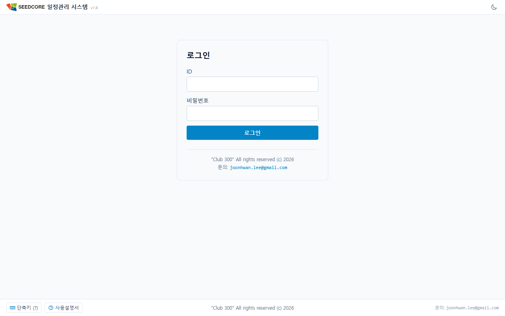

로그인에 실패하면 아래와 같은 안내가 뜹니다.

| 안내 메시지 | 뜻과 대처 |
|-------------|-----------|
| ID 또는 비밀번호가 올바르지 않습니다. | 입력값을 다시 확인하세요. ID가 없는 경우와 비밀번호가 틀린 경우 모두 같은 문구가 나옵니다. |
| 요청이 너무 많습니다. 잠시 후 다시 시도하세요. | 같은 위치에서 1분에 10번을 넘겨 시도한 경우입니다. 잠깐 기다렸다가 다시 시도합니다. |
| 요청 출처 검증에 실패했습니다. 새로고침 후 다시 시도하세요. | 브라우저를 새로고침한 뒤 다시 로그인하세요. |

> 비밀번호를 여러 번 틀려도 **계정이 잠기지는 않습니다.** 실패 횟수는 기록되어 관리자 화면에서 볼 수 있지만, 그것 때문에 로그인이 막히지는 않습니다.

### 1.2 첫 로그인 시 비밀번호 변경

처음 로그인하거나 관리자가 비밀번호를 재설정한 경우에는 **비밀번호 변경** 화면으로 자동 이동합니다. 이때는 비밀번호를 바꾸기 전까지 다른 화면을 쓸 수 없습니다.

- **현재 비밀번호**, **새 비밀번호**, **새 비밀번호 확인**을 입력하고 **변경**을 누릅니다.
- 변경이 끝나면 새 비밀번호로 다시 로그인합니다.

**비밀번호 규칙**

- 새 비밀번호는 현재 비밀번호와 달라야 합니다.
- 그 밖의 제한(길이, 문자 조합, ID 포함 여부)은 없습니다.

> 폐쇄망이라도 계정은 개인별로 구분되므로, 짐작하기 쉬운 비밀번호는 피해 주십시오.

### 1.3 로그인 유지 시간과 연장

한 번 로그인하면 **12시간 동안** 유지됩니다. 이 시간은 로그인한 순간부터 재며, 중간에 계속 작업한다고 해서 저절로 늘어나지는 않습니다.

**남은 시간 확인**

남은 시간이 30분 이하로 줄면 화면 오른쪽 위, 이름 왼쪽에 남은 시간이 나타납니다. 10분 이하로 줄면 붉은색으로 바뀝니다. 여유가 있을 때는 표시되지 않습니다.

**연장 창**

만료 10분 전이 되면 화면 가운데에 **로그인 시간이 곧 만료됩니다** 창이 뜹니다. 남은 시간이 초 단위로 줄어드는 것이 보입니다.

- **로그인 연장**: 그 시점부터 다시 12시간을 확보합니다. 연장 횟수에는 제한이 없습니다.
- **지금 로그아웃**: 곧바로 로그아웃합니다.

연장하지 않고 시간이 다 지나면 자동으로 로그아웃되며, **저장하지 않은 편집 내용은 사라집니다.** 연장 창이 뜨면 편집 중인 내용을 먼저 저장한 뒤 연장하는 것이 안전합니다.

> 자리를 비울 때 화면을 열어둔 채로 두면 12시간이 지난 뒤 로그아웃됩니다. 다시 로그인하면 그대로 이어서 작업할 수 있습니다.

### 1.4 로그아웃

화면 오른쪽 위 헤더의 **로그아웃** 아이콘을 누르면 로그아웃됩니다.

### 1.5 서버 재시작 예고 팝업

관리자가 서버를 다시 시작해야 할 때 예정 시각을 미리 등록합니다. 그러면 접속 중인 모든 화면에 **서버가 곧 재시작됩니다** 창이 떠서 남은 시간을 알립니다.

- **언제 뜨나**: 예정 시각 **5분 전**부터 뜹니다. 남은 시간이 `3분 20초` 처럼 초 단위로 줄어드는 것이 보입니다.
- **닫아도 다시 뜹니다**: **확인**을 누르면 사라지지만, 1분이 지날 때마다 다시 떠서 남은 시간을 알립니다(5분 전, 4분 전, … 1분 전).
- **예정 시각이 지나도 사라지지 않습니다**: 문구가 **곧 재시작됩니다**로 바뀌어 계속 뜹니다. 재시작이 몇 분 늦어지는 일이 흔한데, 그 사이에 창이 사라지면 다시 편집을 시작한 내용을 잃기 때문입니다.
- **서버가 다시 켜지면 저절로 멈춥니다.** 서버가 살아났다는 것이 곧 재시작이 끝났다는 뜻이므로, 관리자가 따로 손대지 않아도 창이 더 뜨지 않습니다.

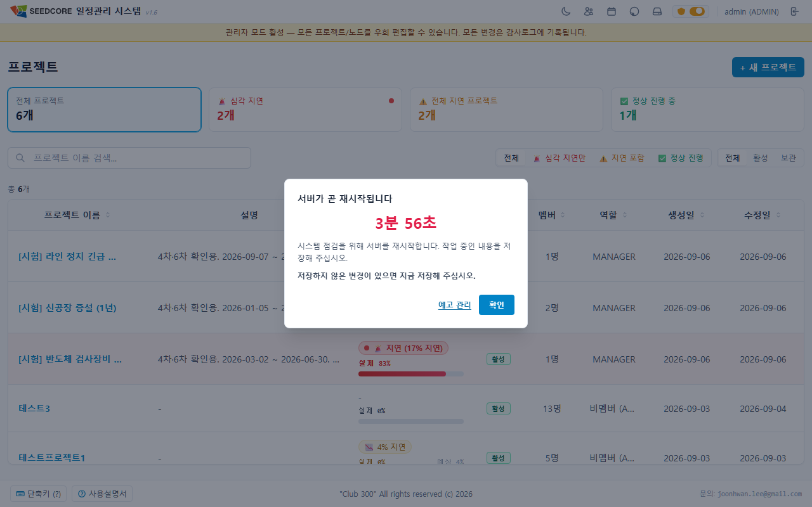

> 창에는 늘 **저장하지 않은 변경이 있으면 지금 저장해 주십시오** 안내가 함께 붙습니다. 편집 중인지 아닌지를 가리지 않고 항상 띄우므로, 이 창을 보면 **먼저 저장한 뒤** 기다려 주십시오. 서버가 내려가는 동안 저장하지 않은 내용은 되살릴 수 없습니다.

서버가 내려간 동안 화면을 새로고침하면 **서버에 연결할 수 없습니다** 안내가 나옵니다. 로그아웃된 것이 아니므로 다시 로그인할 필요가 없습니다. 서버가 돌아오면 보고 있던 화면으로 저절로 되돌아갑니다.

---

## 2. 화면 둘러보기

로그인하면 상단에 항상 **헤더**가 보입니다.

- **왼쪽**: 로고("시드코어")와 "일정관리 시스템" 제목 — 누르면 홈(프로젝트 목록)으로 이동합니다.
- **오른쪽**:
  - **테마 전환**(해/달 아이콘): 다크 모드와 라이트 모드를 전환합니다.
  - 로그인한 사용자 이름 표시 (관리자는 옆에 `(ADMIN)` 배지).
  - **로그아웃** 아이콘.
  - 🔒 관리자에게만 보이는 항목: **사용자 관리** 아이콘, **자동완성 관리** 아이콘, **관리자 모드** 토글 스위치.

관리자 모드가 켜져 있으면 헤더 아래에 노란색 경고 배너가 나타납니다:
> `"관리자 모드 활성 — 모든 프로젝트/노드를 우회 편집할 수 있습니다. 모든 변경은 감사로그에 기록됩니다."`

---

## 3. 프로젝트 목록 다루기

홈 화면(`/`)은 내가 접근할 수 있는 **프로젝트 목록**입니다.

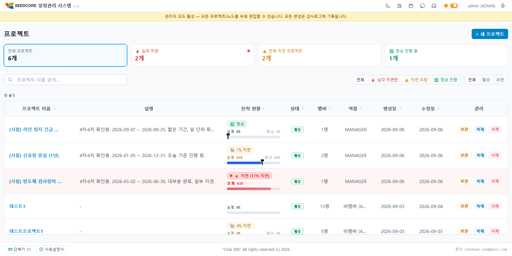

### 3.1 목록 보기

- 표에는 **프로젝트 이름 · 설명 · 상태 · 멤버 · 역할 · 생성일 · 수정일**이 표시됩니다.
- **수정일**: 프로젝트 자체를 고친 때(이름·설명·보관 상태)와 **일정을 고친 때**(추가·수정·순서 변경·삭제) 중 더 최근 날짜입니다. 날짜에 마우스를 올리면 일정이 마지막으로 바뀐 시각을 분 단위까지 볼 수 있습니다. 댓글 작성은 수정일에 반영되지 않습니다.
- **상태 배지**: `활성`(진행 중) / `보관`(보관된 프로젝트).
- **검색**: "프로젝트 이름 검색..." 입력창에 이름 일부를 넣어 거를 수 있습니다.
- **기본 정렬**: 최근에 수정된 프로젝트가 위로 옵니다. 손이 자주 가는 프로젝트를 목록 위쪽에서 바로 찾을 수 있습니다.
- **정렬**: 컬럼 제목을 누르면 오름차순 → 내림차순 → 해제 순으로 바뀝니다. 해제하면 기본 정렬(최근 수정순)로 돌아갑니다.
- **세로 스크롤**: 등록된 프로젝트가 **한 줄로 모두 이어져** 있습니다. 페이지 번호는 없고, 표 안에서 세로로 스크롤해 내려보면 됩니다. 스크롤을 내려도 **표 머리글은 위에 남으므로** 어느 칸이 무엇인지 계속 알 수 있고, 검색창과 지연 현황 카드도 늘 화면에 남습니다.
- **컬럼 폭 조절**: 컬럼 경계선을 드래그하면 폭을 바꿀 수 있고, 바꾼 폭은 브라우저(Local Storage)에 기억됩니다.

> 소속된 프로젝트가 하나도 없으면 "소속된 프로젝트가 없습니다. 관리자에게 멤버 추가를 요청하세요."라고 안내됩니다. 이 경우 관리자에게 프로젝트 멤버 등록을 요청하세요.

### 3.2 프로젝트 열기

프로젝트 행 또는 이름 링크를 누르면 해당 프로젝트의 **상세 화면(간트 차트)**으로 들어갑니다.

### 3.3 🔒 프로젝트 만들기·보관·삭제 (매니저/관리자 전용)

관리자 모드를 켜거나 관리자/매니저 권한이 있으면 목록 화면에 다음이 추가로 나타납니다.

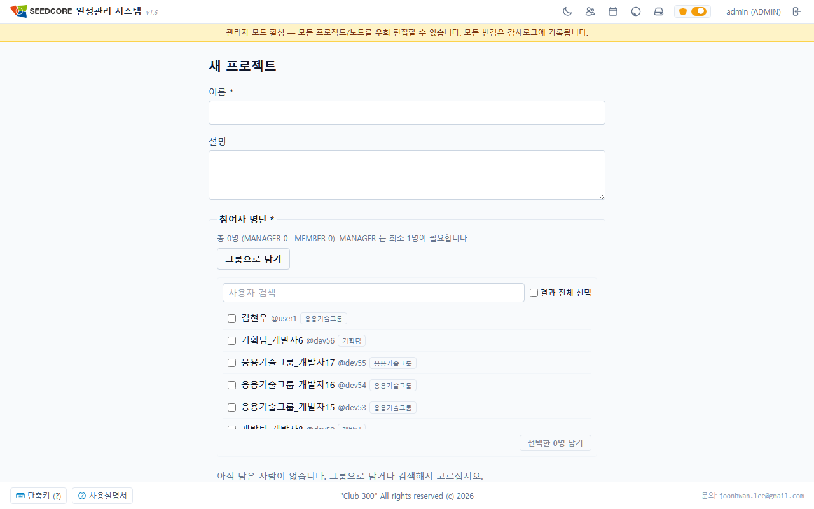

- **+ 새 프로젝트** 버튼: 누르면 새 프로젝트 작성 페이지(`/projects/new`)로 이동하여 이름·설명을 입력하고, MANAGER를 지정해 새 프로젝트를 만듭니다.
- **상태 필터 탭**: 전체 / 활성 / 보관 필터를 통해 프로젝트 상태별 조회가 가능합니다.
- **삭제** 버튼(보관된 프로젝트 행): 보관 상태의 프로젝트를 영구 삭제합니다. 되돌릴 수 없으므로, 확인 모달에서 **프로젝트 이름을 정확히 입력**해야 삭제 버튼이 활성화됩니다.

---

## 4. 일정 트리 다루기 — 그룹과 일정

프로젝트 상세 화면(`/projects/:id`)은 상단 툴바, 왼쪽의 **일정 트리**, 오른쪽의 **간트 차트**로 구성됩니다.

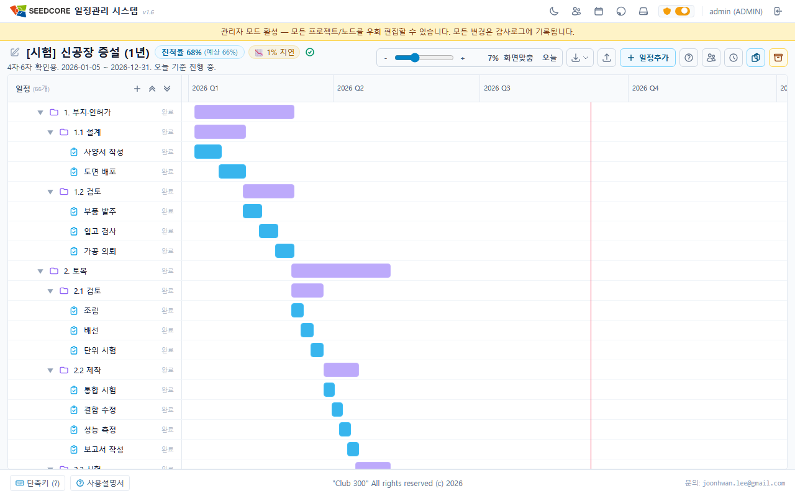

### 4.1 그룹(GROUP)과 일정(ITEM)의 차이

| 구분 | GROUP (그룹) | ITEM (일정) |
|------|--------------|-------------|
| 역할 | 하위 일정을 담는 **폴더** | 실제 작업 단위 |
| 아이콘 / 막대색 | 폴더 아이콘 / 보라색 막대 | 작업 아이콘 / 파란색 막대 |
| 시작일·종료일 | **직접 입력 불가** — 자식 일정에서 자동 계산 | 직접 입력 |
| 진행률 | **직접 입력 불가** — 자식 일정들의 평균 | 직접 입력(0~100%, 5% 단위) |
| 자식 노드 | 가질 수 있음 | 가질 수 없음 |

즉, **그룹의 기간과 진행률은 항상 그 안에 든 일정들로부터 자동으로 계산**됩니다. 그룹 자체의 날짜나 진행률을 손으로 바꿀 수는 없습니다.

> 일정 트리는 최대 10단계 깊이까지만 만들 수 있습니다 (`depth` 0~9). 더 깊게 넣으려 하면 "최대 깊이를 초과하여..." 안내가 뜨고 자식 추가가 막힙니다.

### 4.2 일정 추가하기

일정을 추가하는 방법은 여러 가지입니다(추가는 🔒 매니저/관리자 권한이 필요합니다).

- 상단 헤더 **일정추가** 버튼 또는 단축키 **Ctrl + I**
- 각 행에 마우스를 올렸을 때 나타나는 **↳ 자식 추가** / **+ 형제 추가** 버튼

추가 창에서는:

- 종류를 **ITEM(일정)** 또는 **GROUP(그룹)** 중에서 고릅니다. (단축키 **Alt+1** = 일정, **Alt+2** = 그룹)
- **제목**을 입력합니다. 입력하는 동안 자주 쓰는 단어가 자동완성으로 추천됩니다.
- ITEM이면 **시작일 / 종료일**을 지정합니다. (GROUP은 날짜 입력란이 없습니다.)

**스마트 추가**: 그룹을 선택한 상태에서 추가하면 그 그룹의 자식으로, 일정을 선택한 상태에서 추가하면 그 일정 바로 뒤 형제로 들어갑니다. 기본 시작일은 선택한 항목의 종료일 다음 날로 자동 설정됩니다.

### 4.3 일정 순서·부모 바꾸기

순서 변경과 부모 변경은 **드래그 앤 드롭**으로 한 번에 할 수도 있고, 행의 액션 버튼으로 할 수도 있습니다. 둘 다 🔒 매니저/관리자 권한이 필요합니다.

#### 드래그 앤 드롭으로 옮기기

행에 마우스를 올리면 **제목 왼쪽에 드래그 핸들(⠿)** 이 나타납니다. 이 핸들을 잡고 끌면 순서 변경과 부모 변경이 한 동작으로 처리됩니다.

- **위아래로 끌기**: 놓을 위치가 **가로 삽입선**으로 표시됩니다. 그 선이 있는 자리로 들어갑니다.
- **좌우로 끌기**: 같은 자리에서도 마우스를 **오른쪽으로 밀면 바로 위 항목의 자식**으로, **왼쪽으로 당기면 상위 그룹 밖으로** 빠집니다. 삽입선이 들여쓰기된 위치가 곧 새 부모입니다.
- **커서 배지**: 끄는 동안 커서 옆에 결과를 미리 알려주는 문구가 따라다닙니다. 같은 부모 안에서 순서만 바뀌면 **"3번째로 이동"**, 부모가 바뀌면 **"○○ 안 3번째로 이동"**(최상위로 뺄 때는 **"최상위 3번째로 이동"**)처럼 보입니다.
- **자동 스크롤**: 트리 위/아래 가장자리로 끌면 알아서 스크롤됩니다.
- **취소**: 놓기 전에 **Esc** 를 누르거나 트리 밖에 놓으면 아무 일도 일어나지 않습니다.

놓을 수 없는 자리에서는 배지가 빨간색으로 바뀌며 이유를 알려줍니다.

| 배지 문구 | 뜻 |
|----|------|
| 자기 하위로는 옮길 수 없습니다 | 자기 자신이나 자기 자손 아래로는 넣을 수 없습니다(트리가 끊어집니다). |
| 일반 항목에는 넣을 수 없습니다 | ITEM(일정)은 하위를 가질 수 없으므로 부모가 될 수 없습니다. |
| 최대 깊이 10단계를 넘습니다 | 끌고 있는 가지의 높이까지 더해서 판단합니다. 3단 짜리 그룹은 8단계 자리에 넣을 수 없습니다. |

편집 권한이 없으면 드래그 핸들 자체가 나타나지 않습니다.

> 서버에 이동을 반영하는 동안에는 잠깐 드래그가 잠깁니다. 이때 핸들에 마우스를 올리면 "앞서 옮긴 일정을 반영하는 중입니다. 잠시 후 다시 시도하세요." 툴팁이 뜹니다. 반영이 끝나면 바로 다시 끌 수 있습니다.

#### 액션 버튼으로 옮기기

행에 마우스를 올리면 나타나는 액션 버튼으로도 같은 일을 할 수 있습니다. 드래그가 불편하거나 멀리 떨어진 그룹으로 옮길 때 편합니다.

- **↑ 위로 / ↓ 아래로**: 같은 부모 안에서 순서를 바꿉니다.
- **⇄ 부모 그룹 변경**: 다른 그룹 아래로 옮깁니다. 열리는 대화상자에는 **GROUP 만 나옵니다**(ITEM은 하위 일정을 가질 수 없으므로 부모가 될 수 없습니다). 맨 위의 "◇ 최상위"를 고르면 어느 그룹에도 속하지 않는 최상위 노드로 뺄 수 있습니다. 자기 자신이나 자기 자손, 깊이 제한을 넘는 위치는 선택할 수 없으며 이유가 툴팁으로 안내됩니다.

> 어느 방법으로 옮기든 이력에는 **MOVE(이동)** 로 남고, 형제들의 순서 번호는 빈틈 없이 다시 정리됩니다.

### 4.4 일정 삭제하기

행의 **✕ 삭제** 버튼 또는 일정을 선택한 뒤 **Ctrl + D**로 삭제합니다(삭제는 🔒 매니저/관리자 권한 필요). 그룹을 삭제하면 그 아래 하위 일정까지 함께 삭제됩니다. 삭제 전 확인 창이 뜹니다.

> 일정을 삭제해도 감사 이력은 보존됩니다. 누가 언제 무엇을 지웠는지 프로젝트 이력 페이지에서 확인할 수 있습니다.

---

## 5. 간트/타임라인 뷰

프로젝트 상세 화면의 오른쪽은 시간축을 따라 막대가 그려지는 **간트 차트**입니다. 왼쪽 트리와 오른쪽 시간축은 하나로 연결돼 있고, 가운데 경계선을 드래그해 좌우 폭을 조절할 수 있습니다.

### 5.1 상단 헤더 툴바 기능

프로젝트 상단 헤더에는 다양한 조작 도구가 배치되어 있습니다.

- **프로젝트 정보**: 프로젝트 이름, 전체 진행률 배지(`진행률 N%`), 상태 표시(`활성`/`보관`).
- **간트 배율 조절**:
  - **＋ 확대 / － 축소**: 시간축 배율을 조절합니다. (단축키: **+ / =** 확대, **-** 축소)
  - **화면맞춤**: 전체 일정이 화면에 꽉 차도록 배율을 맞춥니다.
  - **오늘**: 오늘 날짜 위치로 스크롤합니다.
- **내보내기 메뉴**: 간트 차트를 PNG 이미지 파일로 저장합니다.
- **일정추가 버튼**: 새 일정/그룹 추가 창을 엽니다 (Ctrl+I).
- **도움말 버튼 (?)**: 키보드 단축키 안내 창을 열거나 닫습니다 (h 또는 ?).
- **멤버 관리 (사람 아이콘)**: 프로젝트 멤버 관리 페이지(`/projects/:id/members`)로 이동합니다.
- **이력 조회 (시계 아이콘)**: 프로젝트 전체 변경 및 감사 이력 페이지(`/projects/:id/history`)로 이동합니다.
- **🔒 보관 / 복원 / 영구 삭제**: 프로젝트 매니저 및 관리자 전용 상태 변경 버튼입니다.

### 5.2 화면 이동과 배율

간트 도구막대에서 시간 축의 배율을 조절합니다.

- **－ / ＋ 버튼**: 한 번 누를 때마다 **10%씩** 확대·축소합니다. 키보드 `-` / `+` 로도 됩니다.
- **슬라이더**: 두 버튼 사이의 막대를 끌면 한 번에 원하는 배율로 맞춥니다.
- **현재 배율 표시**: 버튼 오른쪽에 `100%` 처럼 지금 배율이 숫자로 나옵니다. 하루가 기본 너비로 보이는 상태가 100% 이며 **1%부터 278%까지** 움직입니다.
- **화면맞춤**: 프로젝트 전체 기간이 화면 폭에 꼭 맞도록 배율을 자동으로 맞춥니다.
- **오늘**: 배율은 그대로 두고 오늘 날짜가 보이는 위치로 이동합니다.

배율에 따라 눈금이 일 → 주 → 월 → 분기 단위로 자동으로 바뀝니다. 주말은 음영(토요일 파랑, 일요일 빨강)으로, 오늘은 빨간 세로선으로 표시됩니다. 막대 위에 마우스를 올리면 날짜 가이드선과 `YYYY-MM-DD (요일)` 툴팁이 나타납니다.

### 5.3 접기/펼치기

- 그룹 행 앞의 삼각형 아이콘을 눌러 하위 일정을 접거나 펼칩니다.
- 트리 헤더 영역에서 모든 일정을 한 번에 정리할 수 있습니다.

### 5.4 막대 드래그로 일정 편집

🔒 편집 권한이 있으면 **ITEM 막대**를 드래그해 날짜를 바로 바꿀 수 있습니다.

- **막대 몸통 드래그**: 일정 전체를 앞뒤로 이동합니다.
- **막대 좌/우 끝 드래그**: 시작일 또는 종료일만 늘리거나 줄입니다.

드래그하는 동안 반투명 미리보기 막대가 보이고, 화면 가장자리로 끌면 자동으로 스크롤됩니다. 드래그 도중 **Esc**를 누르면 즉시 취소되고 원래대로 돌아갑니다.

손을 떼면 **일정 변경 확인** 창이 뜹니다. 바뀌기 전 → 후 날짜가 나란히 보이고, 이 변경으로 함께 조정되는 상위 그룹도 표시됩니다. **적용(Enter)** 또는 **취소(Esc)**를 고릅니다.

> 막대에 마우스를 올리면 그 일정의 **가장 최근 변경 이력**(누가·언제·무엇을 바꿨는지)이 작은 툴팁으로 미리 보입니다.

### 5.5 여러 일정 한꺼번에 처리하기 (선택 모드)

행에 마우스를 올리면 나타나는 **체크박스**로 여러 일정을 동시에 고를 수 있습니다.

- 그룹을 체크하면 그 그룹과 **모든 하위 일정이 함께 선택/해제**됩니다. 일부만 선택된 그룹은 반쯤 칠해진 상태로 표시됩니다.
- 하나 이상 선택하면 상단에 액션 바가 뜹니다: **N개 선택 · 100% 완료 · 삭제 · 선택 해제**.

**일괄 100% 완료**: 선택한 일정들의 진행률을 한 번에 100%로 만듭니다. 그룹이 포함돼 있으면 "그룹 하위 모든 일정을 100%로" 할지, "선택한 일정(ITEM)만" 할지 물어봅니다. 이미 100%인 항목은 건너뜁니다.

**🔒 일괄 삭제**(삭제 권한 필요): 선택한 일정을 하위 항목까지 포함해 영구 삭제합니다. 확인 창이 뜹니다.

### 5.6 이미지로 내보내기 (PNG)

간트 차트를 그림 파일로 저장해 보고서나 발표 자료(PPT)에 넣을 수 있습니다. 상단 툴바의 **내보내기 아이콘**을 누르고 **이미지로 내보내기 (PNG)**를 고르면 설정 창이 열립니다.

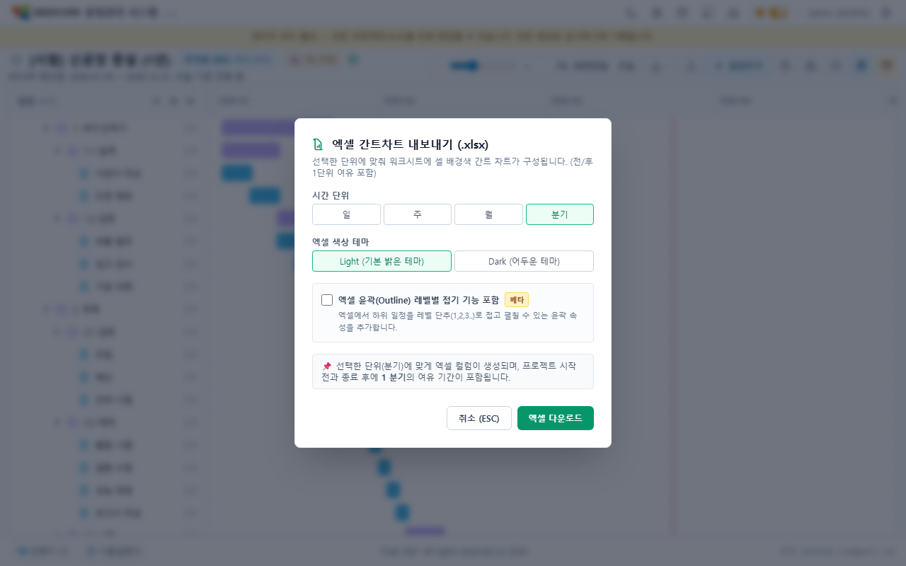

설정 창에서 다음을 고릅니다.

- **눈금 단위**: 일 / 주 / 월 / 분기. 단위가 잘수록 가로로 촘촘하고 넓어집니다. 기간이 긴 프로젝트는 월·분기 단위가 한눈에 보기 좋습니다.
- **펼침 깊이**: **전체**(모든 하위 일정 펼침) 또는 **N단계까지**. 예를 들어 "2단계까지"를 고르면 3단계 아래 하위 일정은 접힌 채로 나옵니다.
- **테마**: **라이트**(흰 배경) / **다크**. 문서·인쇄용으로는 보통 **라이트**가 깔끔합니다. 지금 화면이 다크 모드여도 여기서 라이트를 고르면 흰 배경 이미지로 저장됩니다.

**예상 크기**가 창에 함께 표시됩니다("약 W × H px"). 이미지가 너무 커지면(예: 기간이 긴 프로젝트를 "일" 단위로) 빨간 경고와 함께 내보내기 버튼이 잠깁니다. 이때는 눈금을 더 굵게(주·월) 바꾸거나 펼침 깊이를 줄이세요.

**내보내기**를 누르면 `프로젝트이름_간트_날짜.png` 파일이 내려받아집니다.

---

## 6. 일정 상세 편집

일정 행을 **더블클릭**하거나 선택 후 **Enter**를 누르면 상세 편집 창이 열립니다. 창은 왼쪽(상세 편집)과 오른쪽(통합 작업 히스토리 & 피드) 두 칸으로 나뉩니다.

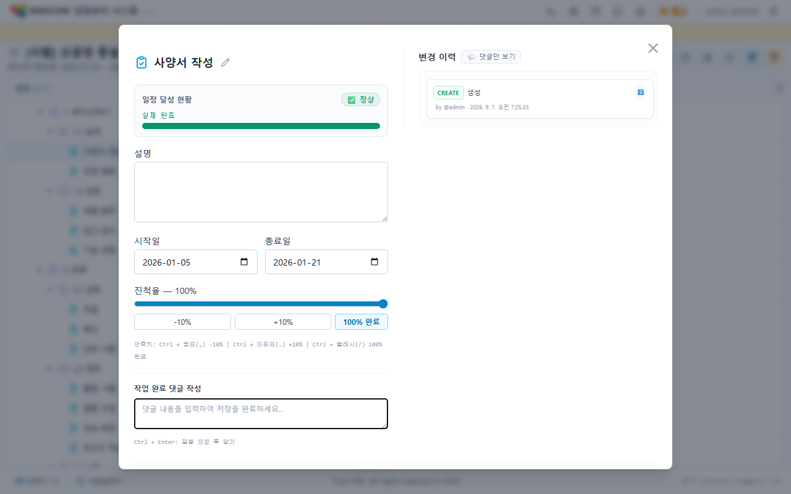

### 6.1 ITEM(일정) 편집

- **제목**: 연필 아이콘을 눌러 바로 고칩니다(자동완성 지원).
- **설명**: 자유롭게 입력합니다.
- **시작일 / 종료일**: 날짜를 고릅니다. 시작일이 종료일보다 뒤가 되지 않도록 서로 보정됩니다.
- **진행율**: 슬라이더로 조절하거나 **-10% / +10% / 100% 완료** 버튼을 씁니다.
  - 단축키: **Ctrl + ,** (-10%), **Ctrl + .** (+10%), **Ctrl + /** (100% 완료)

### 6.2 GROUP(그룹) 편집

그룹은 **시작일·종료일·진행율이 읽기 전용**으로만 표시됩니다. "시작일(집계)", "종료일(집계)", "진행율(자손 ITEM 평균)"처럼 자동 계산된 값이 보이며 직접 바꿀 수 없습니다. 제목과 설명만 수정할 수 있습니다.

### 6.3 저장과 닫기

- 아래 **저장 / 취소** 버튼으로 마칩니다. 상세 변경과 댓글은 함께 한 번에 저장됩니다.
- 저장하지 않은 변경이 있는 상태에서 닫으려 하면 경고가 뜹니다: **그냥 닫기(변경 파기) / 닫기 취소(계속 편집) / 저장하고 닫기(Enter)**.

> 다른 사람이 먼저 같은 일정을 바꿨다면, 저장할 때 "데이터가 다른 사용자에 의해 변경되었습니다. 새로고침 후 다시 시도하십시오." 안내가 뜹니다. 최신 내용을 다시 불러온 뒤 편집하세요.

---

## 7. 댓글과 변경 이력

### 7.1 댓글 (개별 일정 창)

일정 상세 창 오른쪽 **"통합 작업 히스토리 & 피드"**에서 댓글을 작성하고 확인할 수 있습니다.

- 각 댓글은 `💬 이름 @아이디`, 작성 시각, 본문으로 보입니다.
- **댓글 작성**: 아래 "작업 완료 댓글 작성" 칸에 입력합니다. **Ctrl + Enter**를 누르면 상세 변경과 함께 저장되고 창이 닫힙니다.
- **댓글 삭제**: 본인이 쓴 댓글은 삭제할 수 있습니다(확인 창). 관리자는 관리자 모드에서 다른 사람 댓글도 삭제할 수 있습니다.

### 7.2 변경 이력 (개별 일정 창)

일정에 일어난 모든 변화가 사람이 읽기 쉬운 문장으로 기록됩니다.

- 액션 배지: **CREATE(생성) · UPDATE(수정) · MOVE(이동) · DELETE(삭제) · RESTORE(복원)**
- 예: "○○ 님이 진척율을 올렸습니다. (30% → 50%)", "🎉 ○○ 님이 진척율을 100% 완료했습니다!"
- ℹ️ 아이콘에 마우스를 올리면 필드별로 바뀌기 전 → 후 값을 자세히 볼 수 있습니다.

### 7.3 프로젝트 전체 감사 이력 조회

프로젝트 상세 헤더의 **이력 조회 아이콘(시계 모양)**을 누르면 해당 프로젝트 전체의 감사 이력 페이지(`/projects/:id/history`)로 이동합니다.

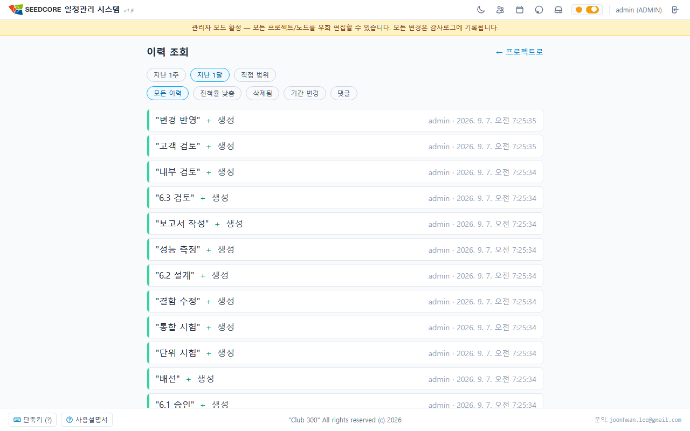

- **기간 필터**: **지난 1주 / 지난 1달 / 직접 범위**(시작일~종료일 선택) 중 선택할 수 있습니다.
- **주제 필터**:
  - **모든 이력**: 전체 이력 및 댓글 표시
  - **진행률 낮춤**: 진행률이 감소된 변경 사항만 필터링
  - **삭제됨**: 삭제된 노드 항목 관련 이력
  - **기간 변경**: 일정 시작일/종료일이 수정된 이력
  - **댓글**: 작성된 댓글 피드만 모아보기
- **삭제된 항목 표기**: 이미 삭제된 일정이라도 취소선 및 `삭제됨` 배지와 함께 이력이 보존되어 투명한 감사가 가능합니다.

---

## 8. 권한과 관리자 모드

### 8.1 역할별로 할 수 있는 일

프로젝트 안에서 내 역할(MEMBER / MANAGER)과 관리자 여부(ADMIN)에 따라 할 수 있는 일이 다릅니다.

| 할 수 있는 일 | MEMBER | MANAGER | ADMIN(관리자 모드 켬) |
|---------------|:------:|:-------:|:---------------------:|
| 일정 내용·진행률 수정, 막대 드래그, 댓글 | ✅ | ✅ | ✅ |
| **일정 추가 / 삭제** | ❌ | ✅ | ✅ |
| 프로젝트 보관·복원·삭제, 멤버 관리 | ❌ | ✅ | ✅ |
| 프로젝트 생성 | ❌ | ❌ | ✅ |
| 사용자 그룹 만들기·인원 배정, 그룹으로 담기 (8.5) | ❌ | ❌ | ✅ |
| 인원별 참여 프로젝트 일괄 관리 (8.6) | ❌ | ❌ | ✅ |
| 계정 완전 삭제, 퇴사·복직 처리 (8.7) | ❌ | ❌ | ✅ |
| 서버 재시작 예고 등록, 접속자 확인 (8.8) | ❌ | ❌ | ✅ |

> **일정 추가·삭제는 단순 편집보다 강한 권한**입니다. 일반 MEMBER가 시도하면 "일정 추가는 프로젝트 매니저 또는 관리자만 할 수 있습니다." 같은 안내가 뜹니다.

### 8.2 🔒 관리자 모드 (ADMIN 전용)

관리자(ADMIN)는 헤더의 **관리자 모드** 스위치로 이 모드를 켤 수 있습니다.

- 켜면 헤더 아래 노란 배너가 뜹니다: `"관리자 모드 활성 — 모든 프로젝트/노드를 우회 편집할 수 있습니다. 모든 변경은 감사로그에 기록됩니다."`
- 관리자 모드에서만 **모든 프로젝트**가 보이고, 프로젝트 생성·삭제·보관 필터 등 관리 기능이 열립니다.
- 관리자 모드에서 한 모든 변경은 감사로그에 별도로 기록됩니다.
- 이 모드를 끄면 일반 사용자처럼 **본인이 멤버인 프로젝트만** 보입니다.

### 8.3 🔒 멤버 관리 (매니저/관리자 전용)

프로젝트 상세 헤더의 **멤버 관리 아이콘(사람 모양)**을 누르면 멤버 관리 페이지(`/projects/:id/members`)로 이동합니다.

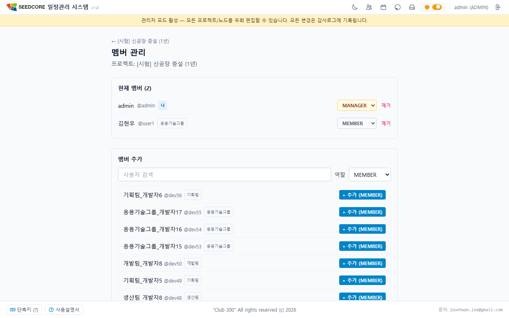

- **현재 멤버 목록**: 이름·`@아이디`·역할 배지(MANAGER / MEMBER)와 **소속 그룹 배지**가 보입니다. **제거** 버튼으로 멤버를 프로젝트에서 제외할 수 있습니다.
- **멤버 추가**: 등록할 사용자 이름을 검색해 역할(MEMBER / MANAGER)을 지정한 후 추가합니다.
- **그룹으로 담기**: ADMIN 이 관리자 모드를 켠 상태에서는 **그룹으로 담기** 버튼이 나타나, 부서째 한 번에 참여자를 채울 수 있습니다(8.5 참고). 프로젝트 MANAGER 는 그룹 목록을 볼 수 없으므로 검색으로 한 사람씩 넣습니다.
- **역할 바꾸기**: 멤버의 역할을 MEMBER ↔ MANAGER 로 바꿉니다. 프로젝트에 마지막 남은 MANAGER 는 격하할 수 없고, 일반 MANAGER 는 자기 역할을 바꿀 수 없습니다(ADMIN 은 본인도 가능).

### 8.4 🔒 사용자 관리 (ADMIN 전용)

헤더의 **사용자 관리 아이콘**을 누르면 계정 관리 페이지(`/admin/users`)로 이동합니다.

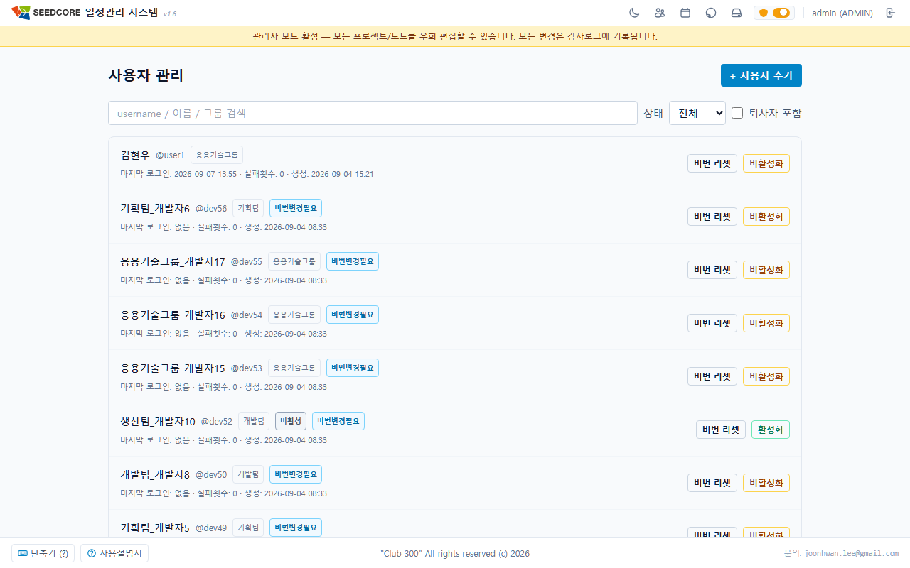

- 사용자 검색(**아이디 · 이름 · 그룹 이름**으로 찾습니다), 상태 필터(전체 / 활성 / 비활성).
- **퇴사자 포함**: 켜면 퇴사 처리된 계정도 목록에 나타나고 행에 `퇴사` 배지가 붙습니다(8.7).
- 각 사용자마다: 표시 이름 수정, 상태 배지(ADMIN·비활성·퇴사·잠김·비번변경필요), **소속 그룹 배지**, 마지막 로그인·실패 횟수 확인.
- **이름을 누르면 사용자 상세 화면**으로 들어갑니다. 거기서 그 사람의 참여 프로젝트와 소속 그룹, 계정 정리를 한자리에서 다룹니다(8.6·8.7).
- 액션: **비번 리셋**(임시 비밀번호 발급), **비활성화 / 활성화**(자기 계정은 불가).
- **잠금 해제** 버튼과 `잠김` 배지도 화면에 있지만, 현재는 로그인 실패로 계정이 잠기지 않도록 되어 있어 실제로 쓸 일이 없습니다. 실패 횟수는 계속 기록되므로 참고 정보로 볼 수 있습니다.
- **+ 사용자 추가**: 아이디(영문·숫자·`._-`, 3~64자, 이후 변경 불가), 표시 이름, 초기 비밀번호를 넣어 새 계정을 만듭니다. 새 사용자는 첫 로그인 때 비밀번호를 바꿔야 합니다.
- **비번 리셋** 시 임시 비밀번호가 **딱 한 번만** 화면에 표시됩니다("이 값은 지금만 표시됩니다."). **복사** 버튼으로 저장한 뒤 당사자에게 전달하세요. 리셋하면 그 사용자의 기존 로그인 세션은 모두 끊깁니다.

### 8.5 🔒 사용자 그룹 관리 (ADMIN 전용)

헤더의 관리자 아이콘에서 **그룹 관리**(`/admin/groups`)로 들어갑니다. 인원을 부서 단위로 묶어 두고, 프로젝트를 만들 때 **그룹째로 참여자를 채우는** 기능입니다. 한 사람은 **한 그룹에만** 속합니다.

- **그룹 만들기**: **+ 최상위 그룹** 으로 시작하고, 그룹 행의 **＋** 로 하위 그룹을 만듭니다. 상위·하위로 엮어 조직 계층을 표현합니다. 왼쪽 계층 트리에서 그룹을 고르면 오른쪽에 상세가 나옵니다.
- **인원 넣기**: 상세의 **+ 인원 추가** 로 여러 명을 한 번에 넣습니다. 고른 사람이 이미 다른 그룹에 속해 있으면 **누가 어느 그룹에 있는지 알려주고 옮길지 물어봅니다.**
- **인원 수**: 트리의 각 그룹에 **하위까지 합친 인원**과 **직속 인원**이 함께 나옵니다.
- **참여 중인 프로젝트**: 그룹 상세 아래쪽에 그 그룹 인원이 참여 중인 프로젝트가 나오고 `8명 중 5명 참여` 처럼 표시됩니다. 빠뜨린 사람을 찾을 때 씁니다.
- **그룹 삭제**: **소속 인원이나 하위 그룹이 남아 있으면 지워지지 않습니다.** 버튼에 마우스를 올리면 그 이유가 나옵니다.

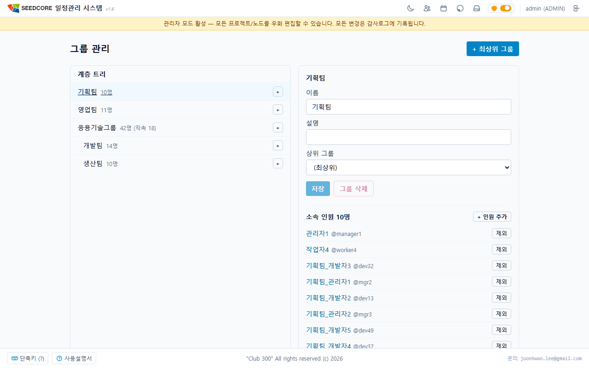

**프로젝트에 그룹째로 담기** — 만들어 둔 그룹은 세 자리에서 씁니다. **새 프로젝트** 화면, **프로젝트 복제** 화면, 기존 프로젝트의 **멤버 관리** 화면(8.3)입니다. 어느 쪽에서든 **그룹으로 담기** 버튼을 누르면 그룹을 골라 인원을 한 번에 채웁니다.

- **상위 그룹을 고르면 하위 그룹까지 함께** 선택됩니다. 필요 없는 하위 그룹은 그 체크만 풀면 되고, 그때 상위 그룹은 **반쯤 체크된 상태**로 바뀝니다.
- 겹치는 사람은 **한 번만** 들어갑니다. **비활성 사용자는 제외**되며 몇 명이 빠지는지 알려줍니다.
- 담긴 사람의 역할은 **MEMBER** 입니다. 담은 뒤 명단에서 사람마다 역할을 바꾸거나 뺄 수 있습니다.

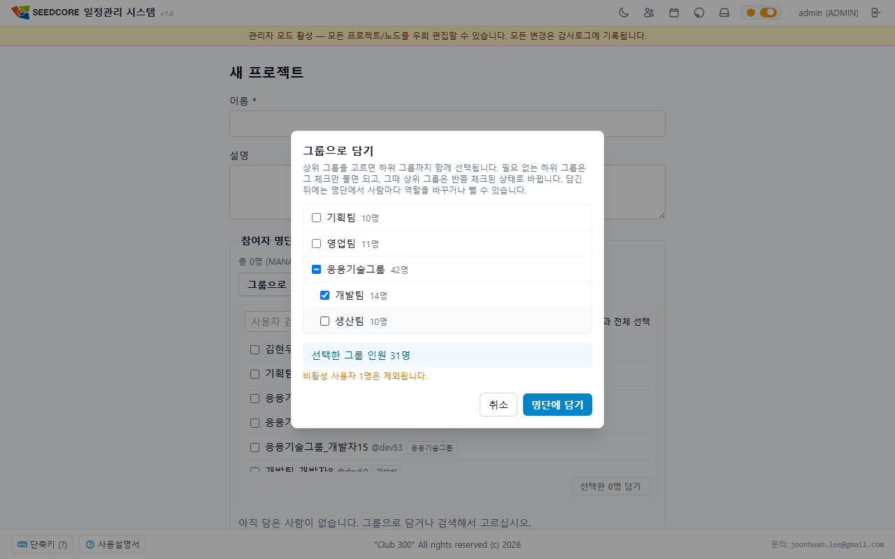

위 그림에서 **응용기술그룹**이 반쯤 체크된 것은 하위 둘 중 **개발팀**만 골랐기 때문입니다. 아래에 담길 인원 수와 제외되는 비활성 사용자 수가 함께 나옵니다.

> **그룹은 명단을 복사하는 방식입니다.** 프로젝트를 만들 때 그룹을 고르면 그 순간의 인원이 참여자로 들어갑니다. **나중에 그룹 인원이 바뀌어도 이미 만들어진 프로젝트의 참여자는 그대로**입니다. 새로 들어온 사람은 그룹에 넣은 뒤 프로젝트에도 따로 넣어 주십시오 — 위의 "참여 중인 프로젝트" 집계가 그 빠진 자리를 찾는 데 쓰입니다.

### 8.6 🔒 사용자 상세 — 인원별 참여 프로젝트 (ADMIN 전용)

사용자 관리 목록에서 이름을 누르면 그 사람의 상세 화면(`/admin/users/:id`)이 열립니다. **한 사람을 기준으로** 참여 프로젝트와 소속 그룹을 한자리에서 다룹니다. 프로젝트를 하나씩 열어 들어가 사람을 찾는 걸음이 없어집니다.

- **참여 프로젝트**: 지금 참여 중인 프로젝트가 모두 나옵니다. 각 행에서 역할을 MANAGER ↔ MEMBER 로 바꾸거나 **제외** 할 수 있습니다. 보관된 프로젝트는 `보관됨` 으로 표시됩니다.
- **+ 프로젝트 일괄 추가**: 프로젝트를 검색해 여러 건을 골라 한 번에 참여시킵니다. 이미 참여 중인 것은 `참여 중` 으로 표시되고 건너뜁니다.
- **소속 그룹**: 같은 화면에서 소속을 옮기거나 뺍니다. 그룹 **자체를** 만들거나 지우는 것은 8.5 의 그룹 관리 화면에서 합니다.
- **표시 이름**도 여기서 고칩니다. 비밀번호 리셋과 활성·비활성 전환은 사용자 관리 목록에서 합니다(8.4).

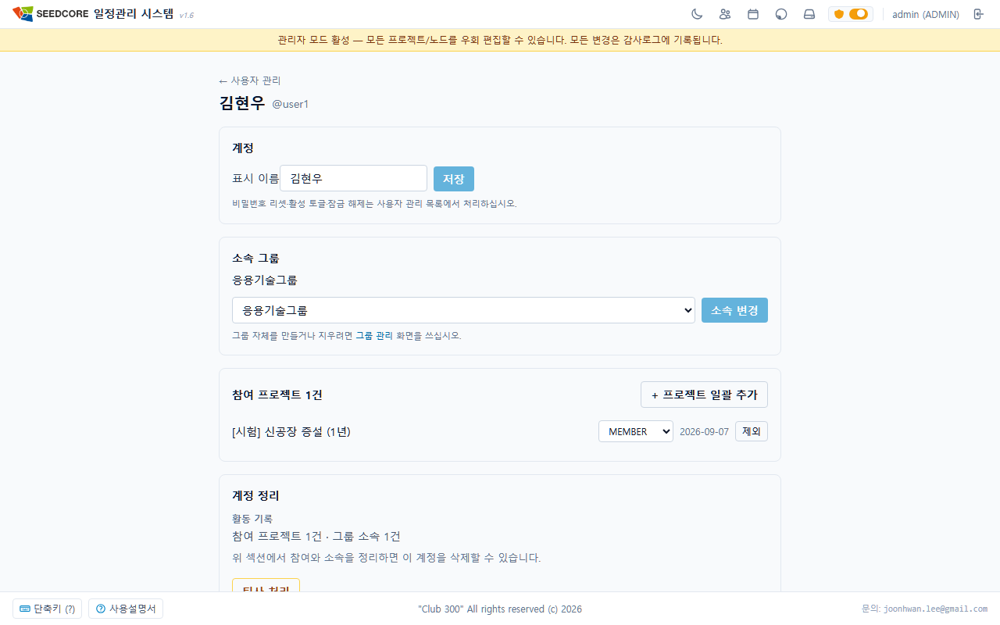

> **소속을 옮기면** 옛 소속이 참여하던 프로젝트에서 뺄지와 새 소속이 참여하는 프로젝트에 넣을지를 **따로 물어봅니다.** 프로젝트 참여는 그룹이 아니라 사람마다 정해지므로 저절로 따라오지 않습니다. 소속 변경은 이미 반영되므로 그 창을 취소해도 소속은 되돌아가지 않고, 프로젝트 참여만 그대로 남습니다.

### 8.7 🔒 계정 정리 — 완전 삭제와 퇴사 처리 (ADMIN 전용)

사용자 상세 화면 아래쪽 **계정 정리** 영역에서 다룹니다. 이 시스템은 "누가 언제 무엇을 고쳤는지"를 추적할 수 있어야 하므로, **활동 기록이 있는 계정은 지울 수 없습니다.** 그래서 두 가지 길이 있습니다.

| 구분 | 계정 삭제 | 퇴사 처리 |
|---|---|---|
| 쓸 수 있는 때 | 활동 기록이 **하나도 없을 때** (잘못 만든 계정 등) | 활동 기록이 있을 때 (대부분의 실제 계정) |
| 결과 | 데이터베이스에서 영구히 사라집니다 | 로그인이 막히고 목록 기본 화면에서 감춰집니다 |
| 되돌리기 | 불가 | 가능 (복직 처리) |

- **활동 기록**을 화면이 세어 보여줍니다. 지울 수 없는 계정에는 **무엇이 남아 있어 지울 수 없는지** 함께 나옵니다(예: "이 계정은 일정 47건 수정, 댓글 3건 기록이 있어 삭제할 수 없습니다"). 참여 프로젝트나 그룹 소속처럼 **정리하면 없어지는 것**은 "정리하면 삭제할 수 있다"고 따로 안내합니다.
- **퇴사 처리하면** 로그인이 막히고 **접속 중이던 세션이 즉시 끊어집니다.** 프로젝트 참여자 선택 목록과 그룹 인원 후보에서도 빠집니다.
- **퇴사해도 남는 것**: 소속 그룹과 참여 중인 프로젝트는 그대로이고, 과거 일정 이력과 댓글의 이름도 그대로 남습니다.
- **퇴사자 다시 보기**: 사용자 관리 목록의 **퇴사자 포함** 을 켜면 나타나며, 상세 화면에서 **복직 처리** 를 누르면 다시 로그인할 수 있습니다.
- **자기 자신은** 퇴사 처리도 삭제도 할 수 없습니다.

> **비활성**과 **퇴사**는 뜻이 다릅니다. 비활성은 "잠시 접속을 막음" 이라 목록에 그대로 보이고, 퇴사는 "조직을 떠나 목록에서 감춤" 입니다.

### 8.8 🔒 서버 관리 — 재시작 예고와 접속자 확인 (ADMIN 전용)

헤더의 관리자 아이콘에서 **서버 관리**(`/admin/server`)로 들어갑니다. 서버를 다시 시작하기 전에 **쓰고 있는 사람에게 미리 알리고**, 지금 누가 접속해 있는지 확인하는 화면입니다. 사용자 쪽에 무엇이 뜨는지는 1.5 를 참고하십시오.

**재시작 예고**

- **빠른 선택**(5분 뒤 · 10분 뒤 · 30분 뒤)으로 시각을 채우거나, 내일 새벽처럼 미리 잡을 때는 날짜와 시각을 직접 고릅니다. 빠른 선택은 **서버 시계**를 기준으로 계산하므로 관리자 PC 시계가 어긋나 있어도 정확합니다.
- **안내 문구**는 기본값이 채워져 있어 그대로 등록해도 됩니다. 이 문구가 사용자 팝업에 그대로 나옵니다.
- **이미 지난 시각은 등록되지 않습니다.**
- **예고는 한 번에 하나만** 걸립니다. 걸려 있는 동안에는 등록 칸 대신 현황과 **예고 취소** 버튼이 나옵니다. 시각을 바꾸려면 취소한 뒤 다시 등록하십시오.
- **사용자에게 언제 보이는지 알려줍니다.** 아직 5분 전이 아니면 "사용자 화면에는 오후 12:25:00 부터 표시됩니다", 표시 구간이면 "지금 사용자 화면에 표시되고 있습니다" 로 나옵니다.
- **지난 예고 기록**을 접었다 펼 수 있고, 예고가 **어떻게 끝났는지** 구분해 보여줍니다 — **관리자 취소** 와 **서버 재시작으로 종료** 가 다르게 나옵니다. 서버가 실제로 언제 재시작되었는지 이 기록으로 확인할 수 있습니다.

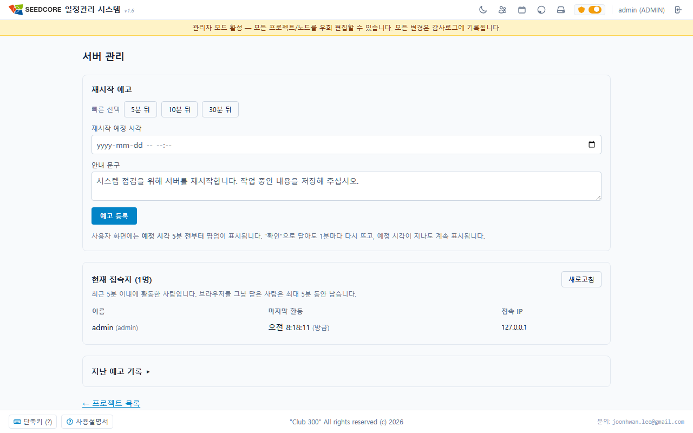

**현재 접속자**

- 이름, **마지막 활동**(몇 분 전), **접속 IP** 가 나오고 30초마다 저절로 갱신됩니다.
- **최근 5분 이내에 활동한 사람**을 접속 중으로 봅니다. 같은 사람이 창을 여러 개 열어 두었으면 한 줄로 묶어 보여주고, IP 가 서로 다르면 함께 나열합니다.
- **브라우저를 그냥 닫은 사람은 최대 5분 동안 남습니다.** 서버가 알 수 없는 정보라 근사치입니다. 그래서 재시작 직전에는 이 목록만 믿지 말고 **예고를 함께 걸어 두는 것**이 실질적인 대비입니다.
- 목록을 보는 **관리자 자신도 포함**됩니다. 다만 이 화면을 켜 두는 것 자체는 활동으로 세지 않으므로, 화면만 켜 놓고 자리를 비우면 5분 뒤 목록에서 빠집니다.

### 8.9 🔒 자동완성 관리 (ADMIN 전용)

헤더의 **자동완성 관리 아이콘**을 누르면 자동완성 사전 관리 페이지(`/admin/autocomplete`)로 이동합니다.

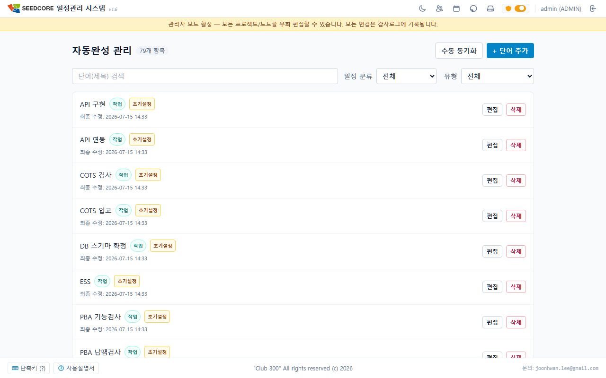

- 일정 제목을 입력할 때 뜨는 자동완성 사전을 관리합니다.
- 단어를 추가·수정·삭제하고, 실제 일정 데이터 기반으로 **수동 동기화**할 수 있습니다.
- 단어마다 분류(그룹 / 작업)와 유형(초기설정 / 자동수집) 및 사용 빈도수가 표시됩니다.

---

## 9. 키보드 단축키 모음

**어느 화면에서나 h** 또는 **?**를 누르면 도움말 창이 열립니다(로그인 화면에서도 열립니다). 화면 맨 아래 **단축키 (?)** 버튼을 눌러도 같은 창이 뜨고, 그 버튼에 마우스만 올려도 같은 목록이 미리 보입니다.

> **단축키가 동작하지 않는 두 경우가 있습니다.** 입력 칸에 커서가 있을 때, 그리고 **체크박스로 여러 일정을 고르는 중**일 때입니다. 뒤의 경우에는 화살표 탐색과 확대·축소까지 함께 멈추므로, 선택을 풀고 나서 다시 쓰십시오.

### 트리·간트 탐색/편집

| 키 | 동작 |
|----|------|
| 클릭 | 일정 선택 |
| 더블클릭 / **Enter** | 일정 편집 창 열기. **Enter 는 일정을 고른 뒤에만** 열립니다(더블클릭은 그 자리에서 바로 열립니다) |
| **Ctrl + I** | 새 일정 추가(스마트 추가). 🔒 매니저/관리자 전용 — 권한이 없으면 눌러도 아무 일이 없습니다 |
| **Ctrl + D** | 선택한 일정 삭제. 🔒 매니저/관리자 전용이며 **고른 일정이 있을 때만** 동작합니다 |
| **↑ / ↓** | 위/아래 일정 이동 |
| **← / →** | (그룹) 접기 / 펼치기 |
| **+ / =** | 간트 확대(한 번에 10%). **＋ 는 Shift 를 함께 눌러야** 나오므로 ＝ 가 더 편합니다 |
| **-** | 간트 축소(한 번에 10%) |
| **h** 또는 **?** | 도움말 창 열기/닫기 (어느 화면에서나) |

### 편집 창 안에서

| 키 | 동작 |
|----|------|
| **Ctrl + ,** | 진행율 -10% |
| **Ctrl + .** | 진행율 +10% |
| **Ctrl + /** | 진행율 100% 완료 |
| **Ctrl + Enter** | (댓글 칸) 저장 후 닫기 |
| **Enter** | (변경 경고 창) 저장하고 닫기 |
| **Esc** | 창 닫기 (변경이 있으면 경고) |

### 일정 추가 창

| 키 | 동작 |
|----|------|
| **Alt + 1** | 종류를 ITEM(일정)으로 |
| **Alt + 2** | 종류를 GROUP(그룹)으로 |
| **Esc** | 창 닫기 |

### 드래그·일괄 확인 창

| 키 | 동작 |
|----|------|
| **Enter** | 적용 / 확정 |
| **Esc** | 취소 (간트 막대 드래그 도중이면 즉시 원복, 트리 행 드래그 도중이면 이동 취소) |

### 자동완성 목록

| 키 | 동작 |
|----|------|
| **↑ / ↓** | 후보 이동 |
| **Enter** | 후보 선택 |
| **Esc** | 목록 닫기 |

---

## 10. 자주 묻는 질문과 문제 해결

**Q. 프로젝트가 하나도 안 보여요.**
아직 어떤 프로젝트에도 멤버로 등록되지 않은 상태입니다. 관리자에게 멤버 추가를 요청하세요.

**Q. 그룹의 날짜나 진행률을 바꾸려는데 입력이 안 돼요.**
정상입니다. 그룹의 기간·진행률은 그 안의 일정들에서 자동 계산되므로 직접 고칠 수 없습니다. 그룹 값을 바꾸려면 안에 든 일정들을 수정하세요.

**Q. "일정 추가는 프로젝트 매니저 또는 관리자만 할 수 있습니다"라고 나와요.**
일정 추가·삭제는 MANAGER 또는 관리자만 할 수 있습니다. 내용 수정·진행률 변경·댓글은 일반 멤버도 가능합니다.

**Q. 저장할 때 "다른 사용자에 의해 변경되었습니다"라고 떠요.**
내가 편집하는 사이 다른 사람이 같은 일정을 먼저 바꾼 경우입니다. 화면을 새로고침해 최신 내용을 불러온 뒤 다시 편집하세요.

**Q. 비밀번호를 여러 번 틀렸는데 계정이 잠기나요?**
잠기지 않습니다. 실패 횟수는 기록되지만 그것 때문에 로그인이 막히지는 않습니다. 비밀번호가 기억나지 않으면 관리자에게 초기화를 요청하세요.

**Q. 작업하는 중에 로그인이 풀렸어요.**
로그인은 12시간 동안 유지되며, 만료 10분 전에 연장 창이 뜹니다. 그 창에서 **로그인 연장**을 누르면 다시 12시간을 확보합니다. 창을 놓쳐 로그아웃되면 저장하지 않은 편집 내용은 사라지므로, 연장 창이 뜨면 먼저 저장한 뒤 연장하는 것이 안전합니다.

**Q. 관리자 모드는 뭔가요?**
관리자(ADMIN)만 쓰는 기능으로, 켜면 모든 프로젝트를 열람·편집할 수 있습니다. 이 모드의 모든 변경은 감사로그에 기록됩니다. 평소에는 꺼두고, 필요한 작업이 있을 때만 켜서 쓰세요.

---

_이 문서는 SAM Scheduler 웹 애플리케이션(apps/web) 기준으로 작성되었습니다._
